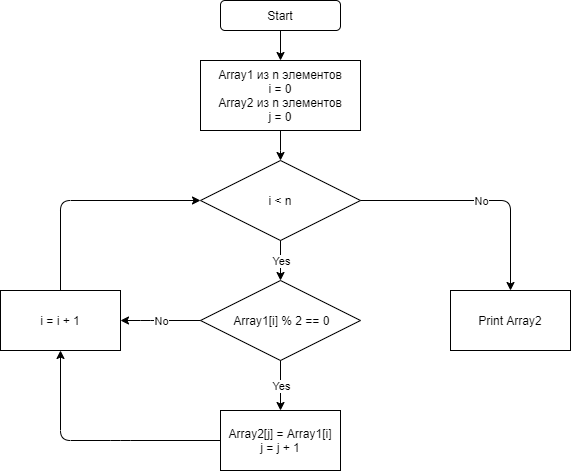
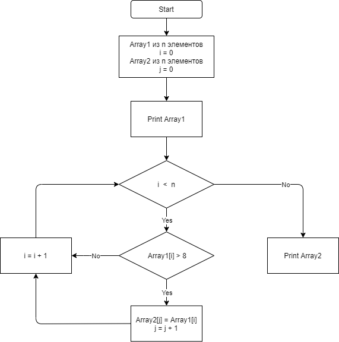

# Control Work
## DEV 1
### Снабдить репозиторий оформленным текстовым описанием решения (файл README.md)

1. Сделал блок-схему решения задачи (DiagramDev1.drawio).

2. Создание кода:
   - **FillArray** - метод для заполнения целочисленного массива псевдо случайными числами. 
   - **PrintRndArray** - вывод на консоль массива случайных чисел.
   - **EvenNumbers** - отсеивание нечётных чисел и занесение чётных чисел в новый массив.
   - **PrintEvenArray** - вывод нового массива с чётными числами или сообщение, что таких чисел нет.

---

## DEV 2
### Снабдить репозиторий оформленным текстовым описанием решения (файл README.md)

1. Сделал блок-схему решения задачи (DiagramDev2.drawio).

2. Создание кода:
   - **FillArray** - метод для заполнения целочисленного массива псевдо случайными числами. 
   - **PrintRndArray** - вывод на консоль массива случайных чисел.
   - **MoreEight** - формирует массив с числами больше 8.
   - **PrintArray2** - вывод нового массива с числами больше 8 или сообщение, что таких чисел нет.
